# gaemboi

<div align="center">
<a href="https://github.com/mario-hess/gaemboi">

</a>
</div>

[](https://opensource.org/licenses/MIT)

This is a Nintendo Game Boy emulator written in Rust. It aims to accurately emulate the functionality and behavior of the original Game Boy hardware.

## Features

- [x] Emulation of Game Boy CPU (Sharp LR35902)
- [x] Precise timing based on instruction cycles and timing registers 
- [x] Support for Game Boy ROMs
- [x] Accurate emulation of memory, registers, and interrupts
- [x] Basic graphics
- [ ] Audio emulation
- [x] Save/Load game progress
- [x] Input handling
- [x] Gamepad support

## Screenshots

<div>


</div>

## Getting Started

### Prerequisites

- Rust (https://www.rust-lang.org/tools/install)

### Development

Clone the repository:
```
git clone https://github.com/mario-hess/gaemboi
```

Install dependencies:

#### Arch

```
sudo pacman -S sdl2 sdl2_ttf sdl2_image
```

#### Ubuntu

```
sudo apt-get install libsdl2-dev libsdl-image1.2 libsdl-image1.2-dev libsdl-ttf2.0-0 libsdl-ttf2.0-dev
```

#### Fedora

```
sudo dnf install SDL2-devel install SDL2_image SDL2_image-devel SDL2_ttf SDL2_ttf-devel
```


### Usage

Drop a `.gb` file into the window or create a folder named 'roms' in the root directory, and place your rom in there.
Run the emulator with a specified ROM file:
```
cargo run --release -- <rom_file_name>
```
Replace <rom_file_name> with the name of your Game Boy ROM file (.gb).

### Additional flags

You can use additional flags to customize the emulator's behavior:

- `-t`:     Display the tile data table.
- `-m`:     Display both tilemaps.
- `-m1`:    Display tilemap 0x9800 - 0x9BFF.
- `-m2`:    Display tilemap 0x9C00 - 0x9FFF.

## Keybindings

<div>

</div>

## Test Results

### CPU (Blargg's Test ROMs)

- [x] 01-special.gb
- [x] 02-interrupts.gb
- [x] 03-op sp,hl.gb
- [x] 04-op r,imm.gb
- [x] 05-op rp.gb
- [x] 06-ld r,r.gb
- [x] 07-jr,jp,call,ret,rst.gb
- [x] 08-misc instrs.gb
- [x] 09-op r,r.gb
- [x] 10-bit ops.gb
- [x] 11-op a,(hl).gb
- [x] instr_timing.gb

### PPU (dmg-acid2 by Matt Currie)

| Status | Failure Example | Failure Description | Functionality Tested |
| ------ | --------------- | ------------------- | -------------------- |
| :heavy_check_mark: | 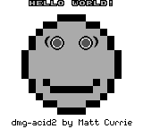 |  Nose missing | Object Palette (bit 4) |
| :heavy_check_mark: | 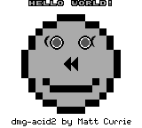 | Nose tiles flipped, right eyelash flipped | Object Horizontal Flip (bit 5) |
| :heavy_check_mark: | 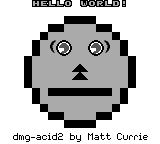 | Nose tiles filpped, mouth straight, eye whites bottom left wrong | Object Vertical Flip (bit 6) |
| :heavy_check_mark: | 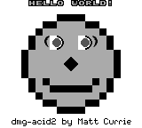 | Eye whites left half wrong | Object to Background Priority (bit 7) |
| :heavy_check_mark: | 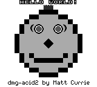 | Hair visible | Background Enable (bit 0) |
| :heavy_check_mark: | 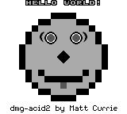 | Tongue visible | Object Enable (bit 1) |
| :heavy_check_mark: | 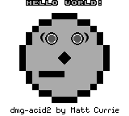 | Half of mouth missing | Object Size (bit 2) |
| :heavy_check_mark: | 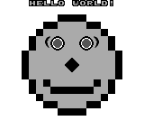 | Footer missing | Background Tile Map (bit 3) |
| :heavy_check_mark: | 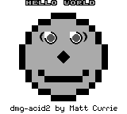 | Eye whites top left quadrant wrong | Background/Window Tile Data (bit 4) |
| :heavy_check_mark: |  | Half of footer missing | Window Enable (bit 5) |
| :heavy_check_mark: | 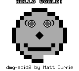 | Right chin missing | Window Tile Map (bit 6) |
| :heavy_check_mark: | 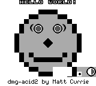 | Eye displayed instead of right chin | Window internal line counter |
| :heavy_check_mark: |  | Left mole visible | Object Priority Lower X Coordinate |
| :x: |  | Right mole visible | Object Priority Same X Coordinate |
| :heavy_check_mark: | 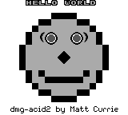 | Hello World missing exclaimation mark (!) | 10 object per line limit |
| :heavy_check_mark: | 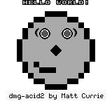 | Half of mouth missing | Bit 0 of tile index for 8x16 objects should be ignored |

## License

This project is licensed under the MIT License - see the [LICENSE](LICENSE) file for details.

## Acknowledgments

- [Pan Docs](https://gbdev.io/pandocs/) - Comprehensive Game Boy technical reference
- [Awesome Game Boy Development](https://github.com/avivace/awesome-gbdev) - A curated list of Game Boy development resources
- [Rust Programming Language](https://www.rust-lang.org/) - Official website for the Rust programming language
